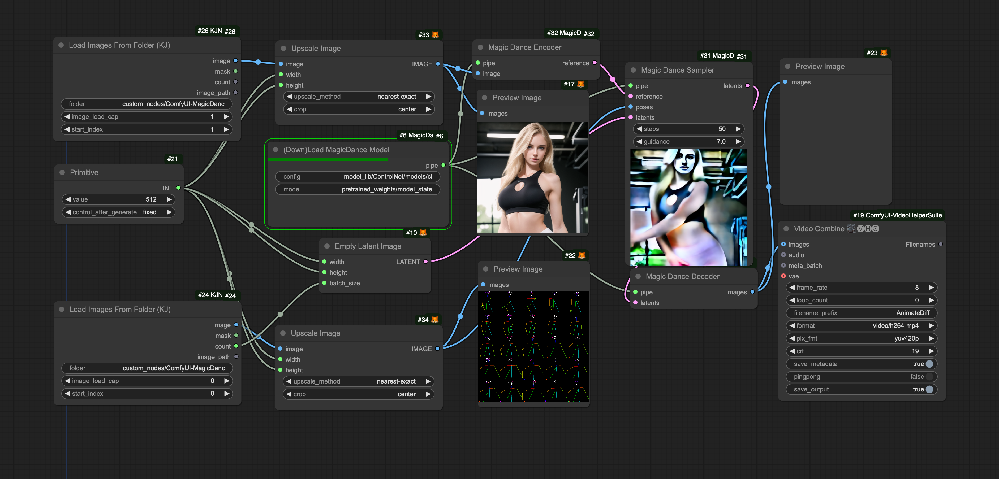

## ComfyUI-MagicDance
ComfyUI supports over Boese0601/MagicDance, which generates a short video from a series of OpenPose images and a static reference image.

## Installation

_Assuming that you are under your ComfyUI root directory_

git clone https://github.com/bombax-xiaoice/ComfyUI-MagicDance custom_nodes/ComfyUI-MagicDance

pip install -r custom_nodes/ComfyUI-MagicDance/requirements.txt

_You can download the model file from huggingface or its mirror site beforehand, or just wait for the first run of (Down)Load MagicDance Model to download it_

wget https://huggingface.co/Boese0601/MagicDance/resolve/main/model_state-110000.th -O custom_nodes/ComfyUI-MagicDance/pretrained_weights/model_state-110000.th

wget https://hf-mirror.com/Boese0601/MagicDance/resolve/main/model_state-110000.th -O custom_nodes/ComfyUI-MagicDance/pretrained_weights/model_state-110000.th

## Example Workflow
Drag the following image into comfyui, or click Load for custom_nodes/ComfyUI-MagicDance/example_data/magicdance-comfy-example.json

Results run under comfy based on poses and image provided by MagicDance

https://github.com/user-attachments/assets/ef54fc3c-7b9b-49d5-a36f-3d6313ff88da

## Tips
Allow multiple poses (pose images) but only one single reference (image encoded to latent). The input latents should set its first dimension the same as the number of poses, width and height set the same as the reference image.

Verified to work on a single NVidia RTX 3070 card with 8G graphics memory, where VAE encoder, TextEncoder, Transformer and VAE decoder are loaded seperately. If you have enough graphics memory. You can try use --highvram on comfy start, where the entire pipeline is loaded into GPU directly to spare unnecessary conversion between CPU and GPU.

It is recommend to choose a preview method (inside comfy Manager), so that you can see the progress of each pose and each sampler step during the long run.
